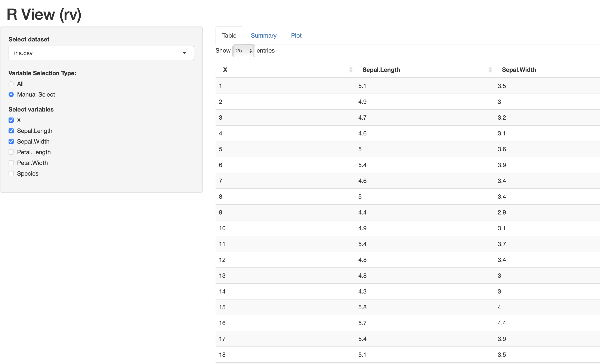

# rv
Just like ["***fv***"](https://heasarc.gsfc.nasa.gov/ftools/fv/) from *ftools*.
**Still developing...** Thank you for any advice.
## Description
Web-based viewer app for table data powered by [Shiny](https://shiny.rstudio.com) and [Plotly](https://plotly.com/r/) using [`R`](https://www.r-project.org). This app can handle `csv`, `tsv`, `fits` (table only) data, with multiple files. Not only it can show the table content itself, but also is possible to summarize information of columns and show a simple plot, interactively. 

## Usage
You can test with sample data `iris.csv` and `btable.fits`.

```
# In terminal,
$ rv iris.csv
$ rv btable.fits
$ rv iris.csv btable.fits (open multiple files)
```

## Installation
> 
1. Download into `"/some/rv/directory/"`
2. In your shell environment, add the path such as:

```
# For bash, 
$ vi ~/.bashrc

# Append this line:
export PATH="/some/rv/directory/:$PATH"
```

## Example (captured)
* `csv` file example:




* `fits` file example:


